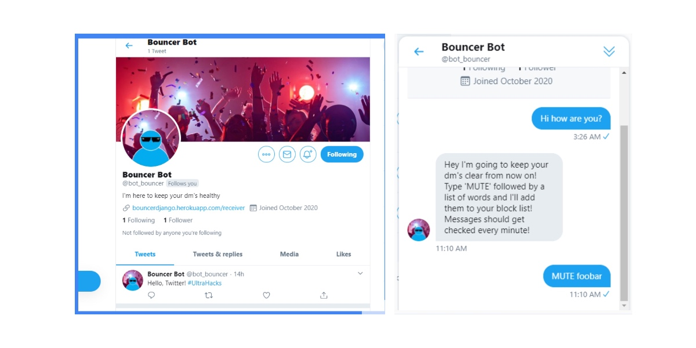

# Ultra Hacks Twitter Bot: Bot Bouncer 🤖

Bot Bouncer is a Twitter bot that utilizes Twitter's mute function for users. The mute function can be a powerful and useful tool to curate
and censor a user's timeline and content they interact with everyday. We wanted to create a bot that could help facilitate Twitter’s built in muting function in a useful way. 

The Bouncer bot mutes certain words the user DMs the bot and censors it so that the user doesn't have to see content that includes that word. We also worked to incorporate images to the bot. The bot analyzes the image a user sends, and calculates the MSE (mean squared error) of the image model, and 
mutes all images in the future that is close in value to the muted image.

